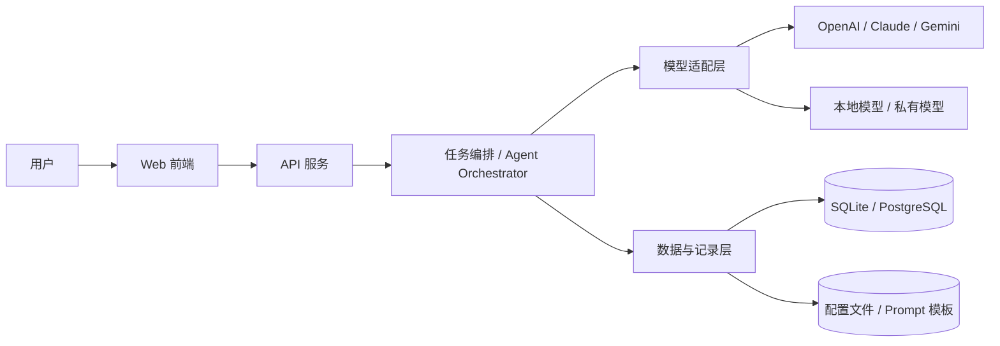

# 申论 Agent 技术架构

## 架构目标

项目以“申论训练 Agent”为核心，提供统一的任务入口、模型适配层和训练闭环，支持用户自由切换 AI 模型并自定义配置。

## 总体结构

## 模块划分

### 1. 前端层

- 题目输入
- 结果展示
- 模型配置页面
- 练习记录与错题本
- 提纲与批改视图

### 2. API 服务层

- 接收题目、答案、配置参数
- 调用 Agent 编排逻辑
- 返回分析结果、提纲和批改建议

### 3. Agent 编排层

- 解析题型与任务目标
- 组织多步骤处理流程
- 生成作答策略
- 执行答案批改与复盘建议

### 4. 模型适配层

- 统一屏蔽不同模型提供方差异
- 支持按用户配置切换模型
- 兼容云端模型与本地模型

### 5. 技术选型建议

- 前端：Vue 3 + Vite
- 后端：Python + FastAPI
- Agent 编排：LangChain
- 数据库：MySQL
- 后续增强：当流程变复杂时，引入 LangGraph 做状态编排

### 6. 数据层

- 保存题目、答案、批改结果
- 保存用户配置与 Prompt 模板
- 保存练习历史和复盘记录

## 核心流程

1. 用户输入申论题目或上传答案
2. 系统识别题型和作答要求
3. Agent 生成提纲、答题思路或批改建议
4. 模型适配层调用用户指定模型
5. 结果返回前端并保存训练记录
6. 用户基于反馈继续优化答案

## 配置设计原则

- 用户在界面中管理自己的 AI 配置，不通过环境变量切换模型
- 用户可切换不同模型和配置方案
- 用户可调整温度、输出长度、系统提示词
- 用户可保存多个配置方案，按场景切换
- 管理员可在后台维护系统默认模型和默认提示词

## AI 配置定位

- `backend/.env` 仅用于系统运行参数，例如数据库地址、端口、基础环境变量
- 模型提供方、API Key、系统默认模型等，统一通过数据库和管理界面维护
- 普通用户只编辑自己的个人配置
- 管理员负责系统默认配置和全局模板

## 选型说明

- **Vue 3**：上手快，组件化清晰，适合快速搭建管理和训练界面
- **Python + FastAPI**：更适合接入 AI 能力，接口层简洁
- **LangChain**：适合 MVP 阶段快速构建 Agent 与工具调用流程
- **MySQL**：适合结构化存储练习、配置和历史记录
- **LangGraph**：若后续需要更复杂的多步骤/多状态 Agent 流程，可作为升级方案

## 部署建议

- 开发期：本地运行，便于调试
- 使用期：支持私有部署
- 后续可增加 Docker 化部署方案
