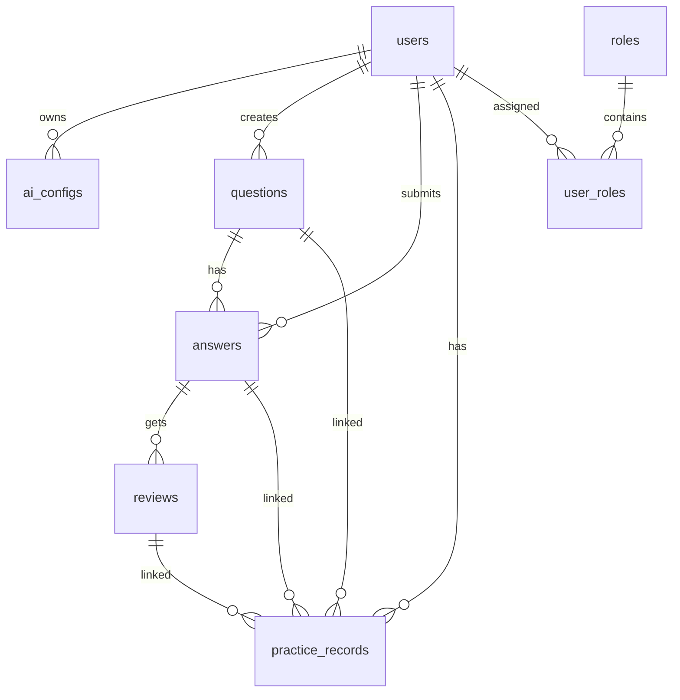

# 申论 Agent 数据库表设计

## 设计原则

- 以 MySQL 为主，结构化存储练习、配置与批改结果
- 表结构尽量支持单机版与后续多用户扩展
- 核心数据与配置分离，方便导入导出

## 核心表设计

### 1. 用户表 `users`

用于保存系统用户信息。

- `id`：主键
- `username`：用户名
- `email`：邮箱，可为空
- `password_hash`：密码哈希
- `status`：状态，启用/禁用
- `created_at`：创建时间
- `updated_at`：更新时间

### 2. 角色表 `roles`

保存系统角色定义。

- `id`：主键
- `name`：角色名，如 `learner`、`admin`
- `display_name`：显示名
- `description`：说明

### 3. 用户角色关联表 `user_roles`

一个用户可拥有多个角色。

- `id`：主键
- `user_id`：用户 ID
- `role_id`：角色 ID

### 4. AI 配置表 `ai_configs`

保存用户个人配置和管理员维护的系统默认配置。

- `id`：主键
- `user_id`：所属用户，可为空，系统默认配置时为空
- `scope`：配置范围，`system` 或 `user`
- `created_by`：创建人，管理员创建系统配置时可记录
- `provider`：模型提供方
- `model_name`：模型名称
- `api_key`：API Key，加密或脱敏保存
- `base_url`：接口地址
- `temperature`：温度
- `system_prompt`：系统提示词
- `is_default`：是否默认配置
- `created_at`：创建时间

**业务说明：**

- 一个用户可有多个个人配置方案
- 系统可保留一个或多个默认配置，供管理员统一维护
- 用户界面切换模型时，本质是切换所选配置，而不是改环境变量

### 5. 题目表 `questions`

保存申论题目内容和分类信息。

- `id`：主键
- `user_id`：所属用户
- `title`：题目标题
- `content`：题目全文
- `question_type`：题型
- `tags`：标签
- `source`：来源
- `created_at`：创建时间

### 6. 答案表 `answers`

保存用户提交的答案。

- `id`：主键
- `question_id`：题目 ID
- `user_id`：用户 ID
- `content`：答案文本
- `version_no`：版本号
- `created_at`：提交时间

### 7. 批改结果表 `reviews`

保存 AI 对答案的批改结果。

- `id`：主键
- `answer_id`：答案 ID
- `score`：评分
- `strengths`：优点
- `issues`：问题
- `suggestions`：修改建议
- `summary`：复盘总结
- `created_at`：生成时间

### 8. 练习记录表 `practice_records`

作为一次完整练习的聚合记录。

- `id`：主键
- `user_id`：用户 ID
- `question_id`：题目 ID
- `answer_id`：答案 ID
- `review_id`：批改结果 ID
- `status`：练习状态
- `is_favorite`：是否收藏
- `created_at`：完成时间

### 9. Prompt 模板表 `prompt_templates`

保存可编辑的提示词模板。

- `id`：主键
- `user_id`：用户 ID，可为空表示全局模板
- `name`：模板名称
- `template_type`：模板类型，如分析、提纲、批改
- `content`：模板内容
- `created_at`：创建时间

## 建议关系图

## MVP 建议

第一版可以先实现以下最小表集：

- `users`
- `roles`
- `user_roles`
- `ai_configs`
- `questions`
- `answers`
- `reviews`
- `practice_records`

`prompt_templates` 可作为第二阶段补充。

## 部署初始化方式

部署时可使用以下两种方式初始化数据库：

1. **SQL 脚本方式**
    - 执行 [backend/sql/schema.sql](backend/sql/schema.sql)
    - 适用于手工部署、容器启动前初始化

2. **后端自动初始化方式**
    - 启动 FastAPI 时调用 `init_database()`
    - 由 [backend/app/db/init_db.py](backend/app/db/init_db.py) 负责建表和默认角色初始化

## 初始化内容

- 自动建表
- 初始化 `visitor`、`learner`、`admin` 三个默认角色
- 保证重复执行时不会重复插入角色数据

