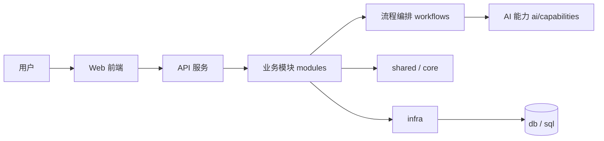

# 申论 Agent 技术架构

## 架构目标

项目以“申论训练与批改平台”为核心，目标不是单纯 CRUD，而是形成完整闭环：

1. 用户登录与配置
2. 题目管理与练习
3. 题目分析、提纲生成、答案批改
4. 批改结果存储与复盘
5. 后续答疑与持续优化

## 总体结构



## 当前推荐分层

```text
frontend/
    app/         应用入口、路由、全局装配
    features/    跨模块业务组合能力
    layouts/     页面壳与布局容器
    modules/     业务域页面、组件、服务、类型
    shared/      通用组件、工具、样式、类型

backend/
    main.py      FastAPI 应用创建、全局中间件与模块路由挂载
    core/        配置、安全、异常、统一响应
    infra/       数据库、LLM、缓存等外部基础设施
    shared/      跨模块枚举、常量、类型、工具
    modules/     auth/question/practice/review/ai_config/email/admin 等业务域
    workflows/    批改链、提纲链、问答链等多步骤流程
    ai/          可复用的细粒度 AI 能力
    db/          Base、session、初始化
    scripts/     初始化与运维脚本
    sql/         建表与升级脚本
    tests/       自动化测试
```

## 分层职责

### 1. `main.py` 与模块 `api.py`

- `backend/main.py` 只处理应用创建、中间件、异常处理和模块路由挂载。
- 各业务域的 HTTP 入口放在 `modules/<domain>/api.py`。
- 模块接口层只处理请求参数收集、依赖注入和响应封装。
- 不承担复杂业务规则。
- 通过模块路由把请求分发到具体业务域。

### 2. `modules/`

- 业务域主承载层。
- 每个模块围绕一个明确业务边界组织代码，例如 `practice`、`review`、`question`、`auth`。
- 模块内部优先自洽，避免跨模块直接互相调用底层仓储。

### 3. `workflows/`

- 承载跨步骤、可追踪、可编排的业务流程。
- 适合放批改链、提纲链、答疑链等复合流程。
- 负责串联多个 AI 能力，但不负责底层模型接入。

### 4. `ai/`

- 承载细粒度 AI 能力单元。
- 当前推荐放到 `ai/capabilities/`。
- 示例：题目分析、要点抽取、要点比对、结构分析、语言分析、规则校验、提纲生成。

### 5. `core/`

- 放全局基础能力。
- 包括配置、安全、异常、统一返回格式、认证辅助等。

### 6. `infra/`

- 放外部能力适配。
- 包括数据库连接、SQLAlchemy 会话、LLM 客户端、缓存和第三方服务封装。

### 7. `shared/`

- 放跨模块共享内容。
- 只能放真正通用、低耦合的内容，例如枚举、常量、类型、工具函数。

### 8. `db/`

- 放数据库基础设施代码。
- 负责 Base、session、init_db、初始化数据与建表。

## 当前后端主链路

当前实际链路已经从“单纯服务层”演进为：

1. `main.py` 挂载的模块 `api.py` 接收请求
2. `modules` 处理业务规则与权限
3. `workflows` 组织批改、提纲、答疑等多步骤流程
4. `ai/capabilities` 执行细粒度分析与生成
5. `infra` 提供数据库、LLM、缓存等外部接入
6. `db` 负责持久化与初始化

## 当前落地情况

- 顶层 `models / repositories / schemas` 已删除，不再作为代码承载层。
- 独立 `backend/app/api/` 目录也已删除，当前使用 `backend/main.py + modules/*/api.py` 的路由组织方式。
- `practice`、`question`、`auth`、`ai_config`、`email`、`admin`、`review` 已进入 `modules/` 边界。
- 练习分析、提纲生成、答案批改、批改结果查询都已经有真实接口链路。
- `review` 作为独立业务域，负责批改结果展示与查询；具体批改步骤由 `workflows/review/` 串联。

## 目录边界约束

- 新增业务接口，优先放入对应 `modules/<domain>/api.py`。
- 业务逻辑优先放入对应 `modules/<domain>/service.py`。
- 读写数据库优先放入对应 `modules/<domain>/repository.py`。
- 多步骤 AI 逻辑优先放入 `workflows/`。
- 可复用 AI 能力优先放入 `ai/capabilities/`。
- 跨模块共享逻辑放入 `shared/`，不要复制到各模块里。

### 5. 技术选型建议

- 前端：Vue 3 + Vite
- 后端：Python + FastAPI
- Agent 编排：LangChain
- 数据库：MySQL
- 后续增强：当流程变复杂时，引入 LangGraph 做状态编排

### 6. 数据层

- 保存题目、答案、批改结果
- 保存用户配置与 Prompt 模板
- 保存练习历史和复盘记录
- 当前已实现用户、角色、用户角色、AI 配置、题目、答案、批改结果、批改链步骤等核心表

## 7. Agent 主链设计

项目当前不再只按“单个 agent”理解，而是按两条主链组织：

### 7.1 批改链

完整设计见 [AGENT_FLOW_DESIGN.md](../05_AI与批改流程/AGENT_FLOW_DESIGN.md)。核心目标是把一次作答处理成一份可解释、可追溯的批改报告。

建议执行步骤：

1. 提交作答
2. 题目解析
3. 参考答案要点抽取
4. 用户答案要点抽取
5. 要点比对
6. 结构分析
7. 语言分析
8. 规则校验
9. 分数计算
10. 生成批改报告
11. 保存结果

### 7.2 答疑链

核心目标是围绕批改结果和用户追问，给出有证据的解释与补充说明。

建议执行步骤：

1. 用户追问
2. 问题分类
3. 检索对应批改证据
4. 进入对应子链
5. 生成回答
6. 保存会话

### 7.3 设计原则

- 批改链产出的结果必须结构化，方便答疑链直接复用
- 答疑链不是重新批改，而是基于批改证据解释
- 每一步都应尽量保存中间证据，便于追溯与复盘
- Agent 职能只负责推理与生成，业务层负责权限、存储和调度

## 当前落地情况

### 已落地模块

- `backend/main.py`：统一挂载各 `modules/*/api.py` 路由
- `backend/app/modules/auth/api.py`：注册、登录、当前用户查询
- `backend/app/modules/ai_config/api.py`：用户与管理员 AI 配置管理
- `backend/app/modules/question/api.py`：题库查询、题目详情、题目创建、导入、更新、删除
- `backend/app/modules/practice/api.py`：练习会话、答案草稿、提纲生成与批改入口
- `backend/app/db/init_db.py`：自动建表与默认角色初始化
- `frontend/src/modules/auth/store/index.ts`：登录态管理与本地恢复
- `frontend/src/modules/auth/services/auth.service.ts`：鉴权接口封装
- `frontend/src/modules/home/pages/HomePage.vue`：首页与入口引导
- `frontend/src/modules/paper/pages/PaperListPage.vue`：统一题库入口
- `frontend/src/modules/practice/pages/PracticeSessionPage.vue`：在线练习页
- `frontend/src/modules/review/pages/ReviewReportPage.vue`：批改报告页
- `frontend/src/modules/practice/pages/HistoryPage.vue`：历史记录页
- `frontend/src/modules/profile/pages/ProfileBasicPage.vue`：个人资料页

## 核心流程

1. 用户进入首页或题库页，选择题目
2. 系统获取题目详情并进入练习页
3. 用户写作后生成草稿或提交批改
4. 批改链执行题目解析、要点抽取、比对、结构分析、语言分析和规则校验
5. 结果返回前端并保存训练记录
6. 用户基于反馈继续优化答案并进入复盘闭环

## 配置设计原则

- 用户在界面中管理自己的 AI 配置，不通过环境变量切换模型
- 用户可切换不同模型和配置方案
- 用户可调整温度、输出长度、系统提示词
- 用户可保存多个配置方案，按场景切换
- 管理员可在后台维护系统默认模型和默认提示词
- 系统运行参数（端口、数据库地址、鉴权密钥、CORS）仍通过 .env 管理

## AI 配置定位

- `backend/.env` 仅用于系统运行参数，例如数据库地址、端口、基础环境变量
- 模型提供方、API Key、系统默认模型等，统一通过数据库和管理界面维护
- 普通用户只编辑自己的个人配置
- 管理员负责系统默认配置和全局模板

## 选型说明

- **Vue 3**：上手快，组件化清晰，适合快速搭建管理和训练界面
- **Python + FastAPI**：更适合接入 AI 能力，接口层简洁
- **LangChain**：适合 MVP 阶段快速构建 Agent 与工具调用流程
- **MySQL**：适合结构化存储练习、配置和历史记录
- **LangGraph**：若后续需要更复杂的多步骤/多状态 Agent 流程，可作为升级方案

## 目录和架构的关系

- 目录结构负责表达代码放在哪里。
- 架构文档负责表达这些目录分别承担什么职责。
- 当前仓库建议以“业务域驱动 + AI 工作流分层”为主线推进：
    - `modules/` 承载业务域
    - `workflows/` 承载流程编排
    - `ai/capabilities/` 承载能力单元
    - `core/` 与 `infra/` 承载基础设施

## 部署建议

- 开发期：本地运行，便于调试
- 使用期：支持私有部署
- 后续可增加 Docker 化部署方案
