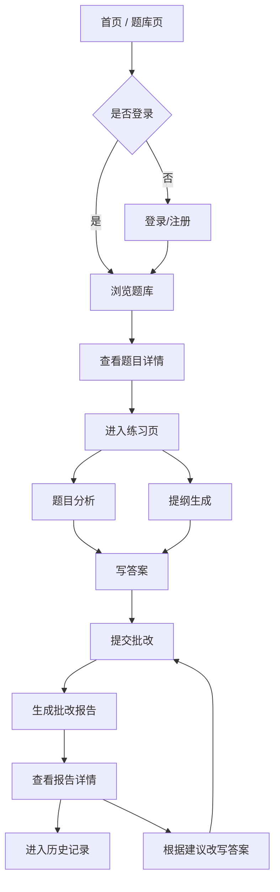
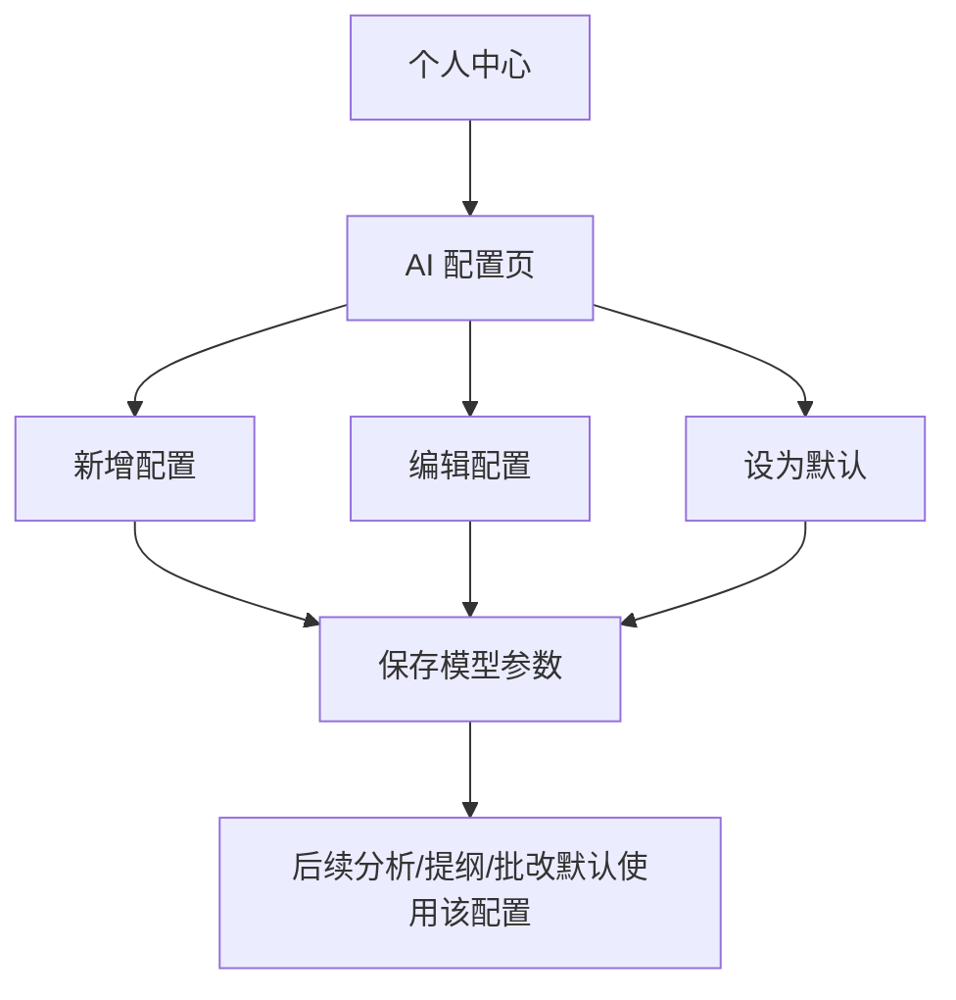
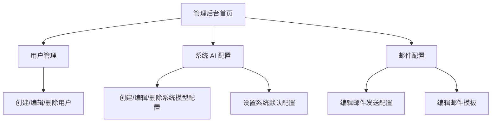
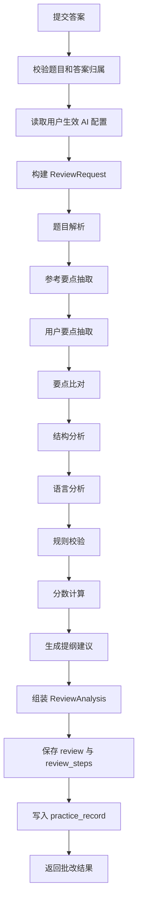
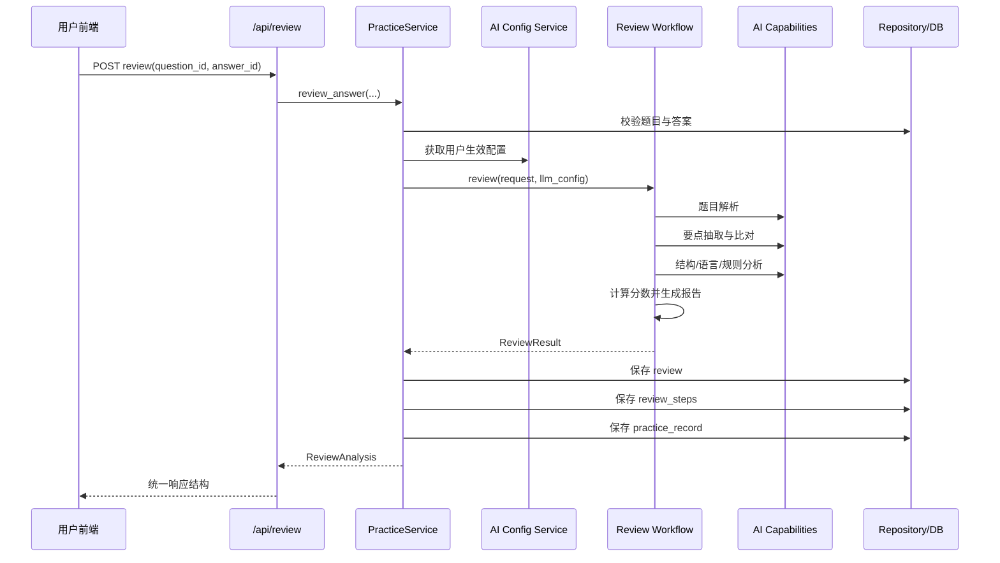
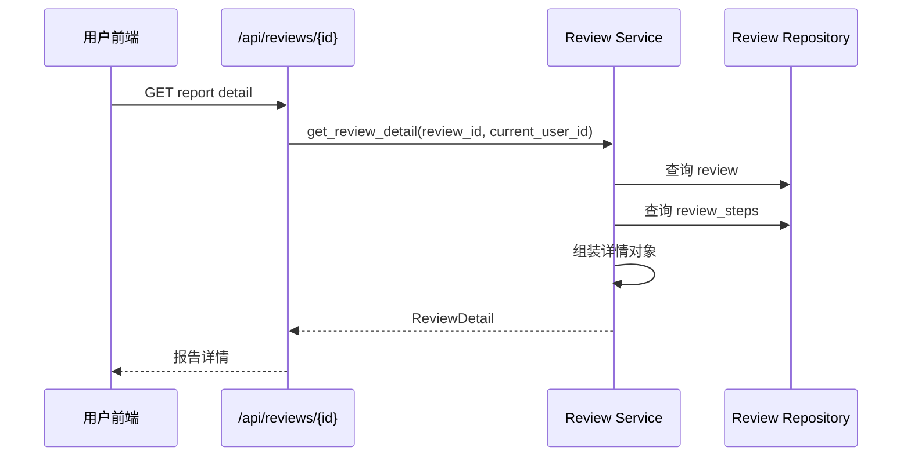
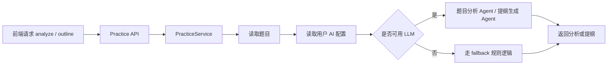

# 申论 Agent 功能与流程设计

## 一、文档目标

这份文档用于回答三个问题：

1. 这个系统到底提供哪些功能
2. 用户在页面上会经历哪些操作流程
3. 后端在接口和工作流层面如何把这些流程串起来

本文档区分：

- **当前已实现**：代码中已有页面、接口或主链路支持
- **建议下一阶段**：适合继续补强的功能

---

## 二、系统定位

申论 Agent 不是单一问答助手，而是一个围绕“申论训练”构建的闭环平台。它的目标是把一次练习拆成连续的训练过程：

题目获取 -> 审题分析 -> 提纲生成 -> 用户作答 -> 智能批改 -> 报告复盘 -> 追问答疑 -> 持续优化

系统面向两类核心角色：

- **普通用户 / 学员**：做题、写作、查看报告、配置自己的 AI 模型
- **管理员**：维护用户、系统默认模型配置、邮件配置、题库内容

---

## 三、功能结构

## 3.1 用户侧功能

### 1. 账号与身份

- 注册
- 登录
- 找回密码
- 查看当前账号信息
- 修改个人资料
- 修改密码

### 2. 题库与选题

- 浏览题库列表
- 按关键词、题型、标签、来源筛选
- 查看题目详情
- 进入练习页开始作答

### 3. 练习工作台

- 对题目做审题分析
- 为当前题目生成作答提纲
- 编写答案
- 提交答案进行批改

### 4. 批改与报告

- 查看总分
- 查看分项得分
- 查看命中要点与漏答要点
- 查看结构分析
- 查看语言分析
- 查看规则校验结果
- 查看修改建议与下一版提纲

### 5. 历史与复盘

- 查看个人批改记录列表
- 打开某次批改报告详情
- 回看批改中间步骤和证据
- 基于历史结果继续修改答案

### 6. AI 个性化配置

- 创建个人 AI 配置
- 维护多个模型方案
- 设置默认配置
- 调整温度、模型、系统提示词、接口地址

## 3.2 管理侧功能

### 1. 用户管理

- 查看用户列表
- 查看用户详情
- 创建用户
- 修改用户信息、状态、角色
- 删除用户

### 2. 系统 AI 配置管理

- 维护系统默认模型配置
- 创建、修改、删除系统级模型方案
- 设置系统默认配置

### 3. 邮件配置管理

- 维护邮件发送配置
- 维护注册/找回密码等邮件模板

### 4. 题库管理

- 创建题目
- 批量导入题目
- 修改题目
- 删除题目

## 3.3 AI 训练引擎功能

### 当前主链

- 题目解析
- 参考要点抽取
- 用户答案要点抽取
- 要点比对
- 结构分析
- 语言分析
- 规则校验
- 分数计算
- 报告生成
- 提纲生成

### 下一阶段建议

- 批改后追问答疑
- 改写建议子链
- 提纲重写子链
- 错题本与专题复盘
- 多轮草稿对比
- 训练计划推荐

---

## 四、当前页面结构

## 4.1 已有页面

- `/`：首页
- `/about`：项目说明
- `/auth`：注册/登录/找回密码
- `/papers`：统一题库入口，当前先承载套卷列表，后续补齐独立题目 Tab
- `/practice/:questionId`：练习页
- `/reports/:reportId`：批改报告页
- `/history`：历史记录页
- `/profile`：个人中心
- `/profile/ai-config`：个人 AI 配置页
- `/admin`：管理后台首页
- `/admin/users`：用户管理页
- `/admin/ai-configs`：系统 AI 配置页
- `/admin/email`：邮件配置页

说明：前台不保留 `/questions` 页面路由；后端仍保留 `/api/questions` 作为题目数据接口。

## 4.2 页面职责分组

### 训练前

- 首页
- 题库页
- 题目详情页

### 训练中

- 练习页

### 训练后

- 批改报告页
- 历史记录页

### 系统配置

- 个人中心
- AI 配置页
- 管理后台相关页面

---

## 五、页面功能流程

## 5.1 用户主流程

## 5.2 用户配置流程

## 5.3 管理员流程

---

## 六、核心业务流程设计

## 6.1 注册登录流程

1. 用户进入 `/auth`
2. 注册时先发送验证码
3. 验证码通过后创建账号
4. 登录成功后获得 Bearer Token
5. 前端保存登录态并恢复当前用户信息
6. 受保护页面按 `requiresAuth` 和 `requiresAdmin` 做路由守卫

## 6.2 题库练习流程

1. 用户从题库页选择一道题
2. 打开题目详情页确认内容
3. 进入练习页开始本次写作
4. 可先调用题目分析接口理解题型和要求
5. 可调用提纲生成接口获得参考结构
6. 用户完成作答并提交批改
7. 系统保存批改结果和练习记录
8. 用户跳转到批改报告页查看结果

## 6.3 批改流程

## 6.4 报告复盘流程

1. 用户打开历史记录页
2. 系统按用户查询批改记录列表
3. 用户点击某条记录进入报告详情页
4. 系统返回完整报告内容和所有步骤快照
5. 用户查看优点、问题、建议和分项评分
6. 用户据此改写答案并再次提交批改

## 6.5 管理员配置流程

1. 管理员登录后台
2. 维护系统默认 AI 配置
3. 配置注册/找回密码邮件模板
4. 管理用户状态和角色
5. 维护题目内容和题库结构

---

## 七、后端接口流程

## 7.1 接口分组

### 认证与用户

- `POST /api/auth/register/send-code`
- `POST /api/auth/register`
- `POST /api/auth/login`
- `GET /api/auth/me`
- `PUT /api/auth/me`
- `POST /api/auth/me/password`
- `POST /api/auth/forgot-password/send-code`
- `POST /api/auth/forgot-password`

### 题库

- `GET /api/questions`
- `GET /api/questions/{question_id}`
- `POST /api/questions`
- `POST /api/questions/import`
- `PUT /api/questions/{question_id}`
- `DELETE /api/questions/{question_id}`

### 练习链路

- `POST /api/analyze`
- `POST /api/outline`
- `POST /api/review`

### 批改记录

- `GET /api/reviews`
- `GET /api/reviews/{review_id}`

### AI 配置

- `GET /api/ai-configs/me`
- `POST /api/ai-configs/me`
- `PUT /api/ai-configs/me/{config_id}`
- `DELETE /api/ai-configs/me/{config_id}`
- `POST /api/ai-configs/me/{config_id}/default`
- `GET /api/ai-configs/system-default`
- `GET /api/admin/ai-configs/system`
- `POST /api/admin/ai-configs/system`
- `PUT /api/admin/ai-configs/system/{config_id}`
- `DELETE /api/admin/ai-configs/system/{config_id}`
- `POST /api/admin/ai-configs/system/{config_id}/default`

### 管理员

- `GET /api/admin/users`
- `GET /api/admin/users/{user_id}`
- `POST /api/admin/users`
- `PUT /api/admin/users/{user_id}`
- `DELETE /api/admin/users/{user_id}`
- `GET /api/admin/email/configs`
- `POST /api/admin/email/configs`
- `PUT /api/admin/email/configs/{config_id}`
- `DELETE /api/admin/email/configs/{config_id}`
- `GET /api/admin/email/templates`
- `POST /api/admin/email/templates`
- `PUT /api/admin/email/templates/{template_key}`
- `DELETE /api/admin/email/templates/{template_key}`

## 7.2 批改接口后端流程

## 7.3 批改详情接口流程

## 7.4 审题与提纲接口流程

---

## 八、当前已实现与建议下一阶段

## 8.1 当前已实现

- 用户注册、登录、找回密码、个人资料维护
- 题库查询、详情、创建、导入、修改、删除
- 题目分析接口
- 提纲生成接口
- 批改主链路与分步骤落库
- 批改报告详情查询
- 历史记录查询
- 个人 AI 配置管理
- 管理员用户管理
- 管理员系统 AI 配置管理
- 管理员邮件配置管理

## 8.2 建议下一阶段

### 第一优先级

- `答疑链`：围绕某次批改结果继续追问
- `错题本 / 弱项本`：按题型、问题类型聚合历史问题
- `二次改写入口`：在报告页直接发起“按建议重写”

### 第二优先级

- `训练计划`：按用户薄弱项推荐练习
- `报告对比`：对比同一道题多次作答的提升轨迹
- `题目收藏 / 专题集`：沉淀长期训练路径

### 第三优先级

- 流式输出
- 更细粒度的 Prompt 模板管理
- 更复杂的多状态工作流编排

---

## 九、推荐的产品主线表达

如果要把这个系统对外或对论文表述得更清楚，建议始终围绕三段主线描述：

### 训练前

- 题库选题
- 审题分析
- 提纲生成

### 训练中

- 沉浸式写作
- 提交批改

### 训练后

- 报告查看
- 历史复盘
- 追问答疑
- 二次改写

这样系统的价值会比“一个会批改的 AI 页面”清晰很多，更像一个完整训练平台。
